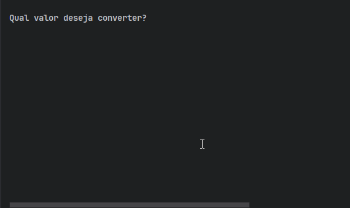
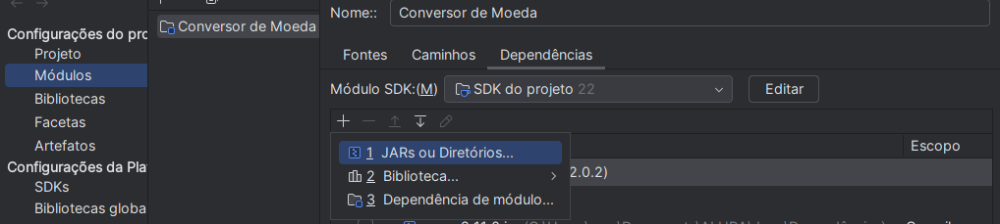

# Conversor de Moedas




## ✨ Bem-vindo ao Conversor de Moedas!

O **Conversor de Moedas** é uma aplicação divertida e prática desenvolvida em Java que permite converter valores entre diferentes moedas em tempo real! Com suporte inicial para 6 moedas principais, você também pode expandir a aplicação facilmente adicionando mais opções.

### Moedas Suportadas Inicialmente:
- USD (Dólar Americano)
- EUR (Euro)
- BRL (Real Brasileiro)
- GBP (Libra Esterlina)
- JPY (Iene Japonês)
- AUD (Dólar Australiano)

Quer mais moedas? Sem problemas! ✌️ Basta editar as classes `ListadeMoedas` e `TextoFormatado` para adicionar novas opções.

---

## Sobre o Projeto

### Funcionalidades
- Conversão precisa entre diversas moedas.
- Interface amigável direto no terminal.
- Suporte a novas moedas personalizáveis.

### Tecnologias Utilizadas
- **Java**: Linguagem principal do projeto.
- **Gson**: Biblioteca para manipulação de JSON.
- **ExchangeRate-API**: API utilizada para buscar as taxas de câmbio.

---

## 🌈 Personalização com Estilo no Terminal

O projeto utiliza a classe `CoresTerminal` para tornar a interação no terminal mais colorida e atraente. Aqui estão os estilos disponíveis:

- **RESET**: Reseta as cores para o padrão do terminal.
- **VERMELHO**: Texto vermelho.
- **VERDE**: Texto verde.
- **AMARELO**: Texto amarelo.
- **AZUL**: Texto azul.
- **NEGRITO**: Deixa o texto em negrito.
- **FUNDOAZUL**: Adiciona um fundo azul ao texto.

Essa classe é configurada para usar códigos de escape ANSI e pode ser facilmente estendida para adicionar mais estilos. Experimente customizar o terminal ao seu gosto!

---

## 🛠️ Requisitos

Antes de usar o projeto, siga estes passos:

1. **Baixe o arquivo Gson.jar**:
   - Faça o download da biblioteca [Gson](https://github.com/google/gson) e adicione-a ao classpath do projeto.

   **Passos para adicionar o Gson.jar:**
   - **Passo 1:** Coloque o arquivo `gson.jar` na pasta principal do seu projeto.
     
   - **Passo 2:** Configure o classpath no seu editor de código ou IDE, como mostrado abaixo:
     

2. **Crie uma conta gratuita na [ExchangeRate-API](https://www.exchangerate-api.com/)**:
   - Após criar a conta, você receberá uma chave "API Key".

3. **Adicione a chave no arquivo `.Config`**:
   - Crie ou edite o arquivo `.Config` na pasta `src`.
   - Insira a chave no seguinte formato:
     ```
     API_KEY = SuaAPIKeyAqui
     ```

---


